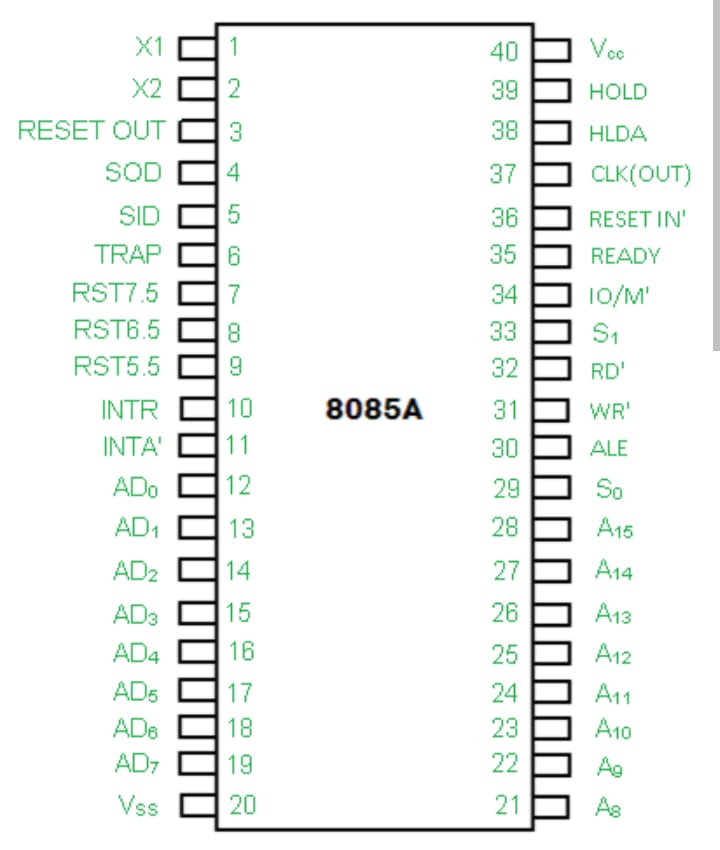

# 8085 Pin Diagram

The 8085 microprocessor is a 40-pin Integrated Circuit (IC). These pins are used for communication with memory, input/output devices, power supply, interrupts, and control signals.

## Categories of Pins

The 40 pins of the 8085 are grouped into the following categories:

- Address Bus
- Address/Data Bus
- Control and Status Signals
- Power Supply
- Clock Signals
- Interrupt Signals
- DMA Signals
- Reset Signals
- Serial Communication Signals