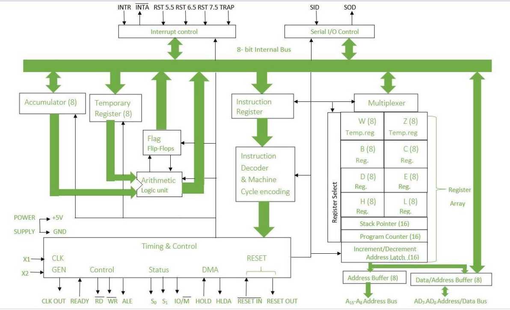

# 8085 Block Diagram

The block diagram of the 8085 microprocessor shows the internal organization of its components and how they work together to execute instructions.

## Main Blocks

- Arithmetic Logic Unit (ALU)
- Accumulator
- General Purpose Registers
- Program Counter (PC)
- Stack Pointer (SP)
- Instruction Register and Decoder
- Timing and Control Unit
- Address Buffer
- Address/Data Buffer
- Interrupt Control
- Serial Input/Output Control

The block diagram helps in understanding how data flows inside the microprocessor during instruction execution.